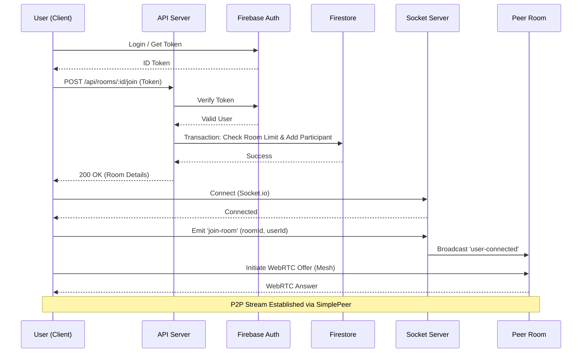

# PeerNet System Architecture

## High-Level Architecture
The PeerNet platform follows a modern client-server architecture using a micro-services approach for scalability, leveraging Firebase for serverless data/auth management and a custom Node.js backend for complex logic and signaling.

```mermaid
graph TD
    subgraph Client ["Client Side (Browser)"]
        UI[React Frontend (Vite)]
        Store[Zustand State Store]
        SocketClient[Socket.io Client]
        WebRTC[SimplePeer WebRTC]
        Canvas[Fabric.js Whiteboard]
        
        UI --> Store
        UI --> SocketClient
        UI --> Canvas
        WebRTC <--> UI
    end

    subgraph Backend ["Backend Services (Node.js/Express)"]
        APIGateway[API Routes /api/*]
        AuthMiddleware[Auth Middleware]
        SignalServer[Socket.io Signaling Server]
        RoomManager[Room Management Logic]
        
        APIGateway --> AuthMiddleware
        AuthMiddleware --> RoomManager
        SignalServer <--> RoomManager
    end

    subgraph Cloud ["Firebase Cloud Services"]
        FirebaseAuth[Firebase Authentication]
        Firestore[Firestore NoSQL DB]
        Storage[Firebase Storage]
    end

    %% Connections
    UI -- HTTPS/REST --> APIGateway
    SocketClient -- WebSocket --> SignalServer
    AuthMiddleware -- Verify Token --> FirebaseAuth
    RoomManager -- CRUD --> Firestore
    UI -- Direct Upload --> Storage
    
    %% Peer to Peer
    WebRTC -. P2P Audio/Video/Data .- WebRTC
```

## detailed Data Flow (Join Session)



## Technology Stack Structure

### Frontend
- **Framework**: React (Vite)
- **Styling**: Tailwind CSS (with Glassmorphism design tokens)
- **State**: Zustand
- **Realtime**: Socket.io-client, Simple-peer, Fabric.js (Whiteboard)

### Backend
- **Runtime**: Node.js
- **Framework**: Express.js
- **Database**: Google Firestore (NoSQL)
- **Authentication**: Firebase Admin SDK
- **Realtime**: Socket.io (Signaling & Whiteboard Sync)

### Database Schema (Firestore)
- `users/`
- `learning_rooms/`
- `room_participants/` (Sub-collection or Top-level)
- `chats/`
- `skills/`
