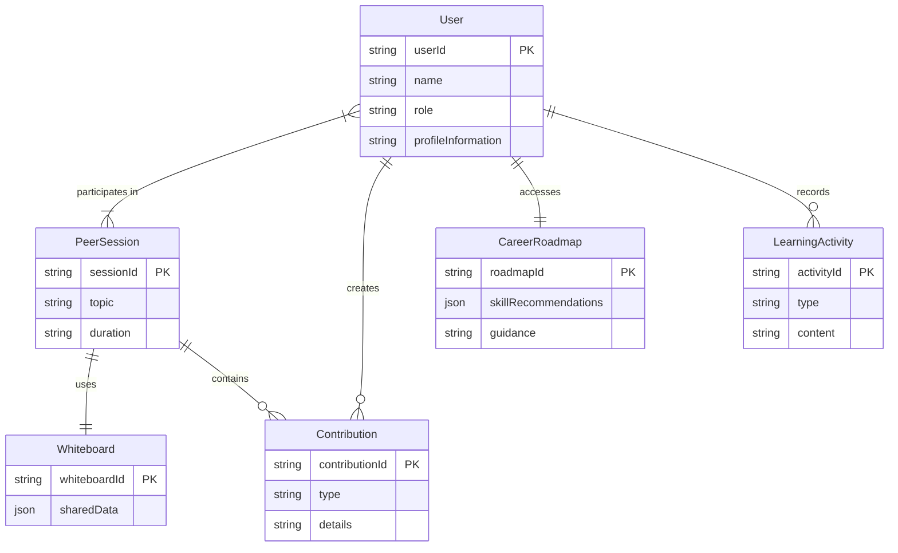

# PeerNet Entity Relationship Diagram

Based on the entities and relationships identified in the PeerNet system.

## Entity Descriptions

- **User**: Stores details of students and self-learners.
- **Peer Session**: Represents collaborative learning sessions.
- **Whiteboard**: Stores shared whiteboard data used during peer sessions.
- **Contribution**: Maintains records of user participation, peer support, and learning activities.
- **Career Roadmap**: Stores personalized career guidance and skill recommendations.
- **Learning Activity**: Records interactions such as discussions, doubts raised, and clarifications.
